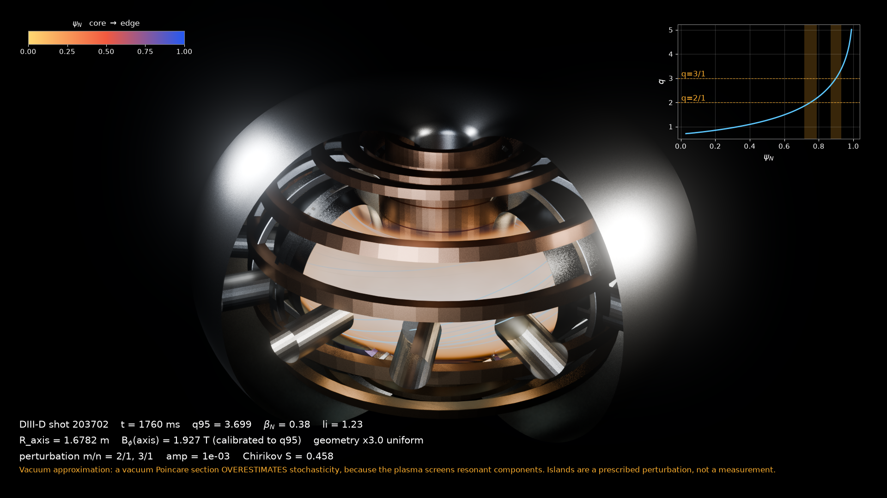
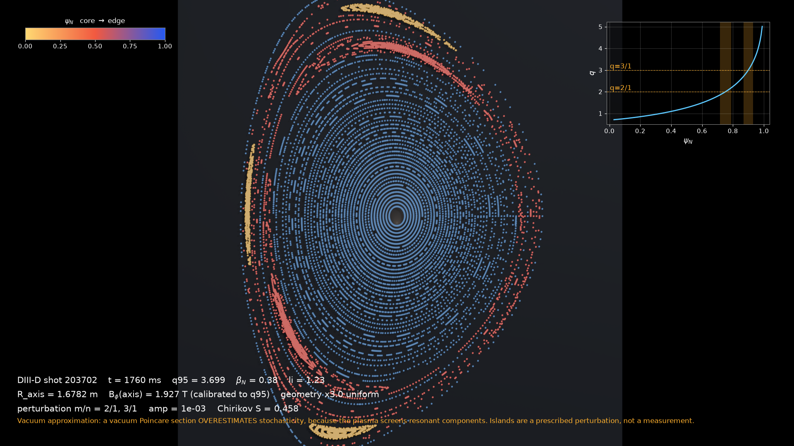
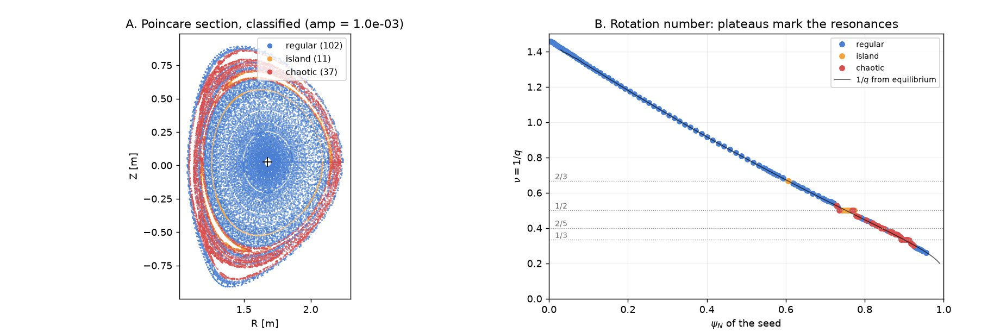
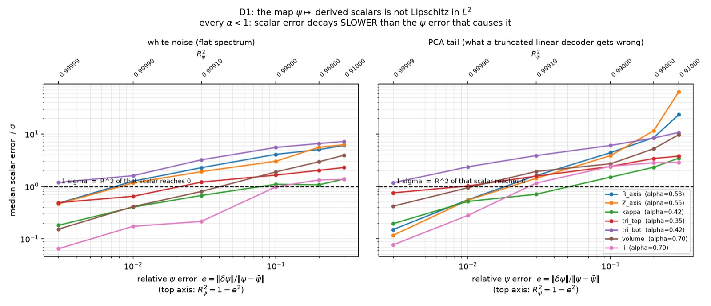
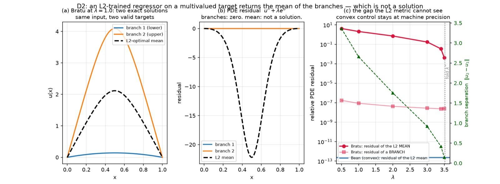
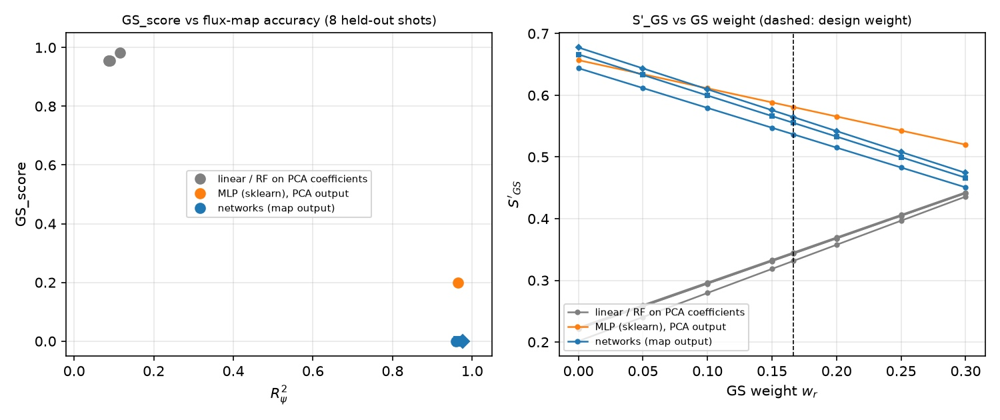
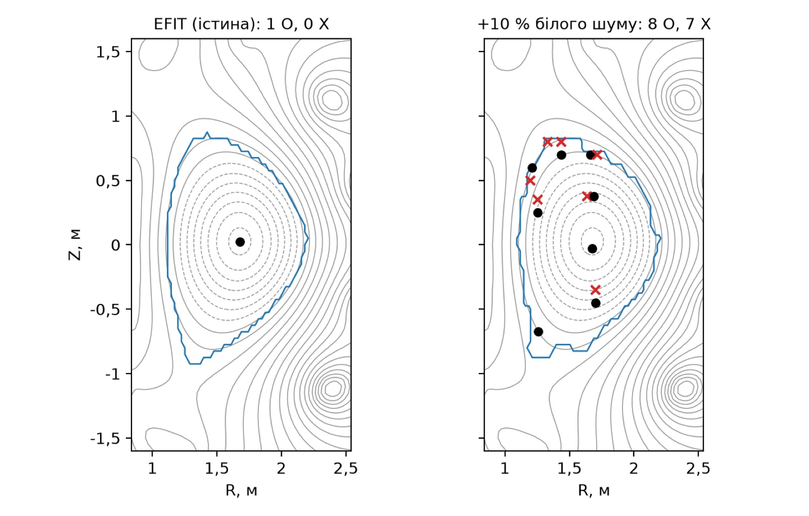
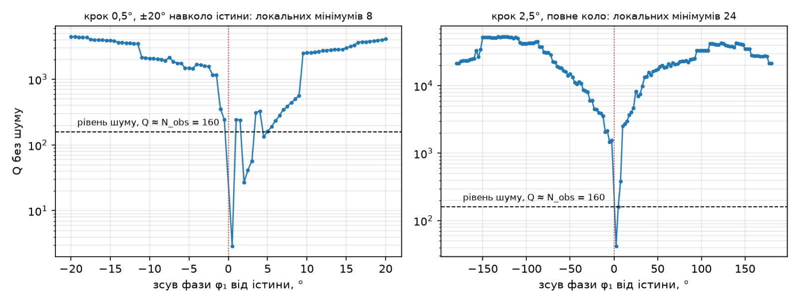
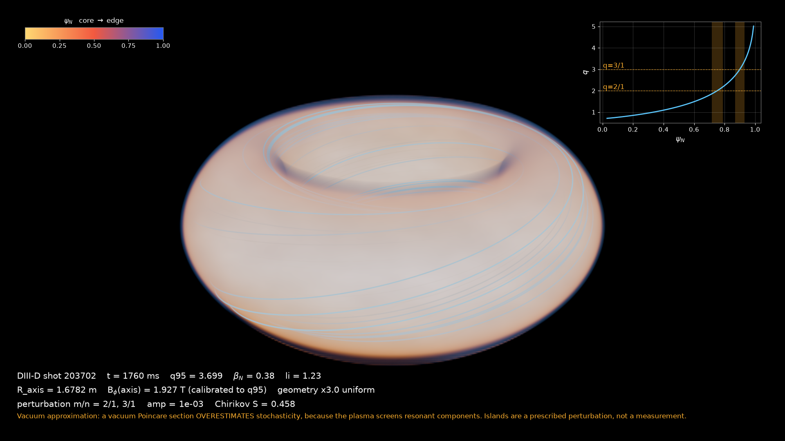
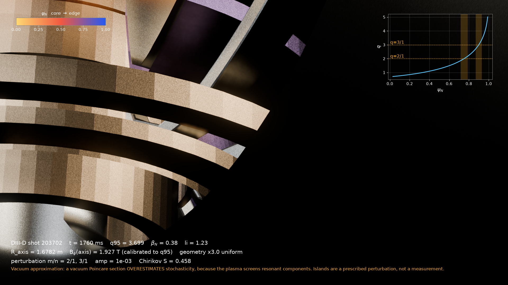

# ML-Hackathon: магнітна рівновага токамака і силові лінії

**Хакатон ФМФ КПІ ім. Ігоря Сікорського, 9–11 жовтня 2026 р.** · AI-лабораторія імені професора В. М. Горшкова

**Автори проєкту:** Наконечний Ілля, Богинський Даниїл, Столяр Софія



*Розріз токамака в Blender; форма плазми й магнітні поверхні взяті з реальної рівноваги DIII-D #203702 ([`tokamak-3d-viz/`](tokamak-3d-viz/)).*

Цей репозиторій — повний робочий архів дослідницького проєкту «Моделювання потоку плазми в контурі токамака»: аналіз літератури, власні вимірювання з кодом, реєстри гіпотез (що підтвердилось, що спростовано, що відкрите), дві методички для учасників і задачі, які ще можна розв'язати методами машинного навчання.

> **Головне правило проєкту.** Кожне твердження має статус: *встановлено* (виміряно власним кодом або прочитано у відкритому джерелі), *спростовано* або *гіпотеза*. Критерії перевірки гіпотези записують **до** запуску. Спростоване не видаляють, а позначають. **Нічого не зникає мовчки.**

---

## Зміст

1. [З чого почати](#1-з-чого-почати)
2. [Фізика за п'ять хвилин](#2-фізика-за-пять-хвилин)
3. [Задача, дані й метрика](#3-задача-дані-й-метрика)
4. [Ієрархія роботи: що де лежить](#4-ієрархія-роботи-що-де-лежить)
5. [Що зроблено: головні результати](#5-що-зроблено-головні-результати)
6. [Питання проєкту: поставлені, вирішені, спростовані, відкриті](#6-питання-проєкту)
7. [Що ще можна зробити інструментами ML](#7-що-ще-можна-зробити-інструментами-ml)
8. [Як працювати з гіпотезами на хакатоні](#8-як-працювати-з-гіпотезами-на-хакатоні)
9. [Як відтворити](#9-як-відтворити)
10. [Джерела](#10-джерела)
11. [Ліцензії й атрибуція](#11-ліцензії-й-атрибуція)
12. [English summary](#12-english-summary)

---

## 1. З чого почати

| Якщо ви… | Відкрийте |
|---|---|
| новачок у фізиці плазми | [Навчальний посібник «Фізика плазми всередині токамака» (PDF, 75 с.)](Методички/Фізика%20плазми%20всередині%20токамака%20—%20навчальний%20посібник%20(2026-10-07).pdf) |
| хочете знати, які гіпотези перевірено і як | [Путівник гіпотезами проєкту (PDF, 90 с.)](Методички/Путівник%20гіпотезами%20проєкту%20(2026-10-07).pdf) |
| шукаєте конкретний пункт (E, R, C, Q…) | [`INDEX.md`](INDEX.md) — усі 167 пунктів реєстрів зі статусами й посиланнями на код |
| шукаєте дорожню карту та графік проєкту | [`roadmap.md`](roadmap.md) — фази розвитку, відкриті дослідницькі завдання та ML-трекер |
| хочете одразу задачу | [розділ 7](#7-що-ще-можна-зробити-інструментами-ml) цього README і розд. 10 путівника |
| хочете бачити першоджерела статусів | [`Our try/00-decisions/`](Our%20try/00-decisions/) — реєстри `ESTABLISHED.md`, `CONJECTURES.md`, `DECISIONS.md`, `open-questions.md`, `CHANGELOG.md` |

---

## 2. Фізика за п'ять хвилин

Повний виклад — у посібнику, розд. 1–4. Тут лише те, без чого не прочитати решту README.

### Полоїдальний потік і рівняння Ґреда–Шафранова

В осесиметричному токамаку магнітне поле задається двома функціями — полоїдальним потоком $\psi(R,Z)$ на радіан і функцією $F(\psi)=RB_\varphi$:

```math
\mathbf B=\nabla\psi\times\nabla\varphi+F(\psi)\,\nabla\varphi .
```

Баланс сил $\mathbf J\times\mathbf B=\nabla p$ зводиться до **рівняння Ґреда–Шафранова (GS)**:

```math
\Delta^*\psi\equiv R\,\frac{\partial}{\partial R}\!\left(\frac1R\frac{\partial\psi}{\partial R}\right)+\frac{\partial^2\psi}{\partial Z^2}
=-\mu_0R^2\,p'(\psi)-F(\psi)F'(\psi).
```

Лінії рівня $\psi$ — магнітні поверхні. Найбільша замкнена з них — межа плазми (LCFS), критичні точки $\psi$ — магнітна вісь (O-точка) і X-точка дивертора. Реконструкція рівноваги (класично — код EFIT, Lao et al., 1985) відновлює $\psi$ за вимірюваннями.

### Силові лінії як гамільтонова система

У магнітних координатах $(\psi_t,\theta^*,\varphi)$ рух уздовж силової лінії — гамільтонова система з «часом» $\varphi$, координатою $\theta^*$, **імпульсом — тороїдальним потоком** $\psi_t$ і **гамільтоніаном — полоїдальним потоком** $\psi$ (E19):

```math
\frac{d\theta^*}{d\varphi}=\frac{\partial\psi}{\partial\psi_t}=\frac1q,\qquad
\frac{d\psi_t}{d\varphi}=-\frac{\partial\psi}{\partial\theta^*}.
```

В осесиметрії переріз Пуанкаре дає рівно контури $\psi$ (E18). Резонансне збурення $\tilde\psi_{mn}\cos(m\theta^*-n\varphi)$ на поверхні $q=m/n$ відкриває **магнітний острів** ширини (у полоїдальному потоці)

```math
w_{mn}=4\sqrt{\frac{\tilde\psi_{mn}\,q}{|dq/d\psi|}} ,
```

а перекриття островів сусідніх мод (параметр Чирикова $S=(w_1+w_2)/(2|\psi_1-\psi_2|)\gtrsim1$) дає стохастичний шар. Одна мода хаосу не дає (E20). Ця формула ширини — місце, де ми двічі помилялися (R4, VR15): хто вважає імпульсом $\psi$, отримує зайвий множник $\sqrt q$.

| Переріз Пуанкаре в 3D | Класифіковані орбіти і профіль $\nu=1/q$ |
|---|---|
|  |  |

*Ліворуч: переріз Пуанкаре DIII-D #203702 з вакуумними модами 2/1 і 3/1 (Blender). Праворуч: класифікований перетин при амплітуді $10^{-3}$ і профіль $\nu(\psi_N)$ проти $1/q$ після виправлення формули ширини (VR15). Власні розрахунки проєкту.*

---

## 3. Задача, дані й метрика

**Fusion Equilibrium Challenge** (Sophelio / General Atomics, arXiv:2609.01750): відновити карту потоку $\psi$ на сітці $65\times65$ разом з $q_{95}$ і $\beta_N$ **без магнітних датчиків** — за струмами котушок полоїдального поля (21 ознака) і профілями томсонівського розсіяння. Корпус — 9 121 розряд DIII-D і MAST, 103,86 ГБ (E26), набір [`Sophelio/fusion-equilibrium-challenge`](https://huggingface.co/datasets/Sophelio/fusion-equilibrium-challenge) на Hugging Face, ліцензія CC BY 4.0.

**Даних у репозиторії немає** (розмір і ліцензія розрядів MAST, див. Q13). Скрипти завантаження: [`fusion equilibrium challenge/starter/`](fusion%20equilibrium%20challenge/starter/), [`c2/fetch_split.py`](Our%20try/03-deep-dives/D1-psi-to-scalars/c2/fetch_split.py) (розбиття «навчання 0–35, тест 60–67»), [`c1/fetch_hf.py`](Our%20try/03-deep-dives/D1-psi-to-scalars/c1/fetch_hf.py) (25 рівномірно взятих розрядів).

**Офіційна метрика** (скорер конкурсу, перевірено самоперевірками `perfect → 1`, `zeros → 0`, E17):

```math
S=0{,}55\,R^2_\psi+0{,}15\,R^2_{q_{95},\beta_N}+0{,}10\,(1-D_{\mathrm{LCFS}})+0{,}20\,\mathrm{Consistency},
```

де Consistency — середній $R^2$ семи скалярів, обчислених **з поданого** $\psi$ (положення осі, витягнутість, трикутності, об'єм, $\ell_i$; E27).

**Наша пропозиція $S'$** (рішення D6, проєкт — [`metric-design.md`](Our%20try/04-novelty/metric-design.md)) додає два члени:

```math
g(\psi)=\min_{p',\,FF'}\frac{\lVert\Delta^*\psi+\mu_0R^2p'(\psi)+FF'(\psi)\rVert}{\lVert\Delta^*\psi\rVert},
```

тобто «чи існує хоч якась пара профілів, за якої це $\psi$ є рівновагою» — лінійні найменші квадрати лише з $\psi$ (E6), і член калібрування невизначеності (передбачувальні смуги на рівнях 50/80/90/95 %). Що з цього вийшло — [розділ 5](#5-що-зроблено-головні-результати).

---

## 4. Ієрархія роботи: що де лежить

```
ML-Hackathon/
├── README.md                  ← ви тут
├── roadmap.md                 ← дорожня карта розвитку проєкту, фази досліджень і ML-трекер
├── INDEX.md                   ← усі 167 пунктів реєстрів (генерується з реєстрів)
├── Методички/                 ← PDF для учасників: путівник гіпотезами і посібник
├── Our try/                   ← ЯДРО: аналіз, рішення, реєстри, власні перевірки з кодом
│   ├── 00-decisions/          ← реєстри: ESTABLISHED (E, R), CONJECTURES (C), DECISIONS (D),
│   │                            open-questions (Q), CHANGELOG (журнал кожної правки)
│   ├── 01-landscape/          ← конкурси й бенчмарки, датасети, «де стеля, а де є за що змагатися»
│   ├── 02-field-map/          ← карта поля: обернена задача, нейророзв'язувачі PDE, UQ,
│   │                            надпровідність, чому не прогноз зриву, Пуанкаре й топологія
│   ├── 03-deep-dives/         ← власні розбори з кодом і числами:
│   │   ├── D1-psi-to-scalars/ ←   ψ → скаляри не ліпшицеве; перевірки C1, C2 (c1/, c2/)
│   │   ├── D2-gs-nonuniqueness/ ← середнє гілок не є розв'язком; Бін як опуклий контроль
│   │   └── D3-poincare-inverse/ ← Tokamap, обернена задача; перевірка C5 (c5/)
│   ├── 04-novelty/            ← метрика S′, GS-нев'язка, топологія; перевірки C4 (c4/), C6 (c6/)
│   ├── 05-concept/            ← концепт хакатону (укр./англ.)
│   └── 99-bibliography/       ← refs.bib, журнал верифікації джерел, перевірка Landreman 2026
├── guide/                     ← LaTeX-джерела путівника + скрипти рисунків і покажчика
├── manual/                    ← LaTeX-джерела посібника + код прикладів
├── geometry/                  ← LaTeX-посібник «Геометрія токамака» (30 с.)
├── tokamak-3d-viz/            ← Blender-візуалізація, трасування силових ліній, острови,
│                                обернена задача на стенді DIII-D, 3D JET 1975/1983; findings.md
├── Tokamak-GS-solver/         ← наш патч до відкритого розв'язувача GS (сам код — в оригіналі)
├── fusion equilibrium challenge/ ← starter kit конкурсу (MIT), наш бейзлайн і SCORE.md
├── analysis/                  ← 38 конспектів джерел корпусу, нотатки до JET
└── library/                   ← опис корпусу джерел (самі PDF не публікуються — авторські права)
```

**Як ідуть дані між частинами.** Література (`analysis/`, `02-field-map/`) → гіпотеза в `CONJECTURES.md` з критерієм спростування і вартістю → попередня реєстрація `THEORY.md` у теці перевірки → код і результати (`results.json`, `eval.json`) → вердикт у `ESTABLISHED.md` (E або R) → рядок у `CHANGELOG.md` → розповідь у путівнику з фрагментами коду.

---

## 5. Що зроблено: головні результати

### 5.1. Точна карта потоку ще не дає точних скалярів (розбір D1)

Відображення $\psi\mapsto$ похідні скаляри **не ліпшицеве** в нормі $L^2$: похибка скаляра росте як $\varepsilon^\alpha$ з показниками $\alpha\in[0{,}35;\,0{,}70]$, усі менші за 1 (E1). Положення осі $R_{\mathrm{axis}}$ досягає похибки $1\sigma$ уже при $R^2_\psi=0{,}99993$. Механізм для осі встановлено точно: нахил 1 нижче $\eta^*=\lambda h^2/2$ і $\approx\tfrac12$ вище, де $\lambda$ — кривина $\psi$ в O-точці (E36). На навченій моделі це видно прямо: UNet_Lite має $R^2_\psi=0{,}976$, але Consistency 0,179 — гірше, ніж PCA+Ridge (0,270) з майже марною картою (E37).



### 5.2. Середнє двох гілок — не розв'язок (розбір D2)

Рівняння GS може мати кілька розв'язків при однакових вимірюваннях (E21; Ham & Farrell 2024, Pentland et al. 2025). Регресія з $L^2$-втратою на багатозначній цілі повертає **середнє гілок**: на моделі Братý його відносна нев'язка 1,22 проти $6{,}4\cdot10^{-8}$ у справжньої гілки, а в опуклому контролі (критичний стан Біна) — $2{,}5\cdot10^{-13}$ (E4, E24). $L^2$ цього не бачить за побудовою.



### 5.3. Чи є прогноз рівновагою — GS-нев'язка (E6–E8, E38, R12)

Нев'язка $g(\psi)$ рахується лише з поданого $\psi$. Істина EFIT дає 0,009, а та сама карта з 1 % білого шуму — 0,650: **стрибок у 70 разів** (E6). Масштаб $\psi$ на неї не впливає (E7), але до гладкої похибки й PCA-усічення вона сліпа (E8). На восьми бейзлайнах: мережі з $R^2_\psi=0{,}96$–$0{,}98$ мають $g=0{,}81$–$0{,}96$ — **гірше, ніж істина з 1 % шуму**, тобто їхні карти взагалі не рівноваги (E38). Як доданок до метрики член порядку моделей стійко не змінює (R12): його природніше робити **шлюзом**.



### 5.4. Топологія карти потоку (E9–E16)

Скелет істини канонічний: рівно одна O-точка, нуль сідел, сума індексів +1 (E9). При $R^2_\psi=0{,}993$ шумна карта вже має **20 «островів», яких не існує**. Сума індексів зберігається навіть у хаосі, тож як метрика вона марна — працює лише **кількість** критичних точок (E11; R5: крива Ейлера менш чутлива). При перенесенні DIII-D → MAST значення $\psi$ ламаються, а топологія — ні (E16, R7).



### 5.5. Обернена задача: за силовими лініями відновити спектр мод (C5 → R13)

Стенд без відображення $\mathbf B=\nabla\times(\psi_{\mathrm{total}}\nabla\varphi)$ зберігає $\nabla\cdot\mathbf B=0$ точно для будь-якого числа мод (VE21). У лінеаризованій постановці складність задає вибір спостережуваного: обумовленість 17,9 для усередненої екскурсії проти 5,8 для фазово-роздільної (VE22–VE25). Але нелінійна перевірка 1 жовтня за критеріями, записаними до запуску, **спростувала** гіпотезу «задача трактабельна за 48 год»: базовий багатостартовий МНК не відновив 3 амплітуди і 3 фази при 3 % шуму ні на виправленій Tokamap (0 з 40), ні на стенді DIII-D (0 з 3), хоча хибних мінімумів немає (R13). Причина — «скляний» ландшафт нев'язки (E40).



### 5.6. Інше встановлене й виправлене

- **Tokamap** точно симплектичний ($\max|\det J-1|=5{,}6\cdot10^{-8}$, E30); наше багатомодове узагальнення — ні (1,7, R8); корінь помилки — похідна замість первісної у твірній функції (E35).
- **Розв'язувач GS** брав модуль $k$ замість параметра $m=k^2$ у функції Гріна: похибка потоку +9 % біля нитки, +42 % при $k^2=0{,}95$, $\times8$ при $k^2=0{,}5$ (E33). Виправлено і покрито тестами — [`Tokamak-GS-solver/`](Tokamak-GS-solver/).
- **Landreman 2026:** вкладені магнітні поверхні можливі й без осесиметрії; рівняння статті перевірено власним кодом до $10^{-10}$–$10^{-12}$ (E39, [`99-bibliography/landreman2026/`](Our%20try/99-bibliography/landreman2026/)).
- **3D JET 1975/1983** у Blender — розмірна база і розрізи для посібника.

| Плазма і магнітні поверхні | Дивертор і слід на стінці |
|---|---|
|  |  |

---

## 6. Питання проєкту

Повні формулювання, критерії спростування й номери рядків — у [`INDEX.md`](INDEX.md) і в реєстрах [`Our try/00-decisions/`](Our%20try/00-decisions/).

### 6.1. Чітко поставлені питання (на які відповідає проєкт)

1. **Чи є передбачена карта потоку рівновагою?** Чи можна це перевірити лише з $\psi$, без $p'$ і $FF'$? → так, GS-нев'язка (E6); мережі з високим $R^2_\psi$ рівновагами не є (E38).
2. **Чи гарантує мала похибка карти малу похибку фізичних скалярів?** → ні: відображення не ліпшицеве (E1, E36, E37).
3. **Що робить $L^2$-регресія, коли рівновага неєдина?** → повертає середнє гілок, яке не є розв'язком (E4, E21).
4. **Чи зберігається топологія при перенесенні між машинами?** → так, значення — ні (E16, R7).
5. **Чи відновлюється спектр збурення за силовими лініями?** → інформація є, але базовий фіт застрягає (R13, E40).
6. **Як оцінювати чесність невизначеності для поля $65\times65$?** → відкрито (C4, C6).
7. **Чи стабільний Deep Ritz на неопуклій задачі плазми?** → відкрито (C7).

### 6.2. Вирішені: встановлено (40 пунктів E)

| Що встановлено | Пункти |
|---|---|
| Відображення ψ → скаляри не ліпшицеве; механізм для осі | E1, E3, E14, E36, E37 |
| Неєдиність GS, середнє гілок, Бін як опуклий контроль | E4, E5, E21, E24 |
| GS-нев'язка лише з ψ: дискримінативна, інваріантна до масштабу, сліпа до гладкості; мережі — не рівноваги | E6, E7, E8, E38 |
| Топологія: канонічний скелет, стійкість до шуму, перенесення між машинами | E9–E13, E15, E16 |
| Гамільтонів опис силових ліній, острови, інтегровність | E18, E19, E20, E39 |
| Обернена задача: Tokamap, спостережуване, корінь R8, скляний ландшафт | E30–E32, E35, E40 |
| Поле літератури, корпус і ліцензії | E22, E23, E25–E29 |
| Виправлення в розв'язувачі GS | E33, E34 (частково) |
| Візуалізація: 34 встановлені пункти VE | VE1–VE33, VE11a |

Закриті питання: Q11 (HDB5 — CC BY 4.0), Q12 (атрибуція Sophelio). Ухвалені рішення D1–D9 — у [`DECISIONS.md`](Our%20try/00-decisions/DECISIONS.md), кожне з умовою перегляду.

### 6.3. Спростовані (13 власних тверджень R + 16 VR)

| ID | Твердження, яке ми мали і яке не витримало перевірки | Що натомість |
|---|---|---|
| R1 | «Ніхто не нав'язує інтегральну крайову умову жорстко в нейроархітектурі» | McClenaghan et al., 2024 — нав'язує |
| R2 | «Критичний стан Біна і вільна межа плазми — одна математика» | опукла проти неопуклої; Бін став опуклим контролем (кращий результат) |
| R3 | «Симплектична нейромережа для силових ліній — наша ідея» | HénonNet, Burby–Tang–Maulik, 2021 |
| R4 | «ψ — канонічний імпульс» | імпульс — $\psi_t$; помилка повторилась у коді й виправлена |
| R5 | «Крива Ейлера краща за лічильник критичних точок» | вона — інтегральна версія лічильника |
| R6 | «$\alpha=\tfrac12$ — універсальний закон» | механізм для осі — E36 |
| R7 | «Провал перенесення має топологічну складову» | топологія вціліває (E16) |
| R8 | «Tokamap переноситься на суму мод підстановкою» | корінь — E35 |
| R9 | «Провали LCFS на MAST — систематичний сигнал» (C8) | артефакт знака |
| R10 | «Три кластери α — три механізми» (C1) | стабільно лише на 3 демо-розрядах |
| R11 | «Спектральна вага з $S(k)$ покращує моделі» (C2) | усі 95 % ДІ містять 0 |
| R12 | «GS_score змінить упорядкування бейзлайнів» (половина C4) | нестійко (74–75 % < 95 %); краще шлюз |
| R13 | «Обернена задача Рівня 3 трактабельна за 48 год» (C5) | 0 з 40 і 0 з 3; ландшафт скляний (E40) |

Спростування — не провал: R2 і R7 після спростування дали більше, ніж містили до нього.

### 6.4. Що потрібно довести або спростувати

| ID | Гіпотеза | Що її спростує | Вартість |
|---|---|---|---|
| **C3** | Кривина $\lambda$ в O-точці ($1/\sqrt\lambda$) придатна для стратифікації тесту | вузький розподіл $\lambda$ або слабкий зв'язок з $\alpha$ (розкид широкий: 0,13–3,6) | ~1 год |
| **C4** | Член Calibration змінить упорядкування бейзлайнів | порядок той самий, що за $S$ | ~пів дня (разом з C6) |
| **C6** | Одночасні конформні смуги на полі $65\times65$ — правильна форма UQ-члена | покриття недосяжне без абсурдної ширини | ~день |
| **C7** | Deep Ritz на задачі плазми нестабільний щодо зерна, на Біні — стабільний | обидва стабільні | ~день, потрібні обидва солвери |
| C9, C10 | Коваріантне подання для перенесення; успадковане зміщення міток EFIT | — | відкладено свідомо |

C4 і C6 у реєстрі активні. Попередню перевірку від 05.10, зроблену поза реєстром, описано в [`Our try/04-novelty/c6/README.md`](Our%20try/04-novelty/c6/README.md): одночасна смуга вузька, але покриття на 8 тестових розрядах визначають один-два розряди.

Також відкриті: VQ1–VQ5 і VC3–VC4 (візуалізація), U2 (підлога хаосу в бекенді котушок), фізичні питання Q1–Q5 (реалістичність задачі без магнітних датчиків, виродження $p'$/$FF'$, неєдиність у робочих режимах, надпровідні магніти).

---

## 7. Що ще можна зробити інструментами ML

Кожна задача спирається на виміряне в проєкті й має готовий код для старту.

| # | Задача | Звідки | ML-інструменти | Почати з |
|---|---|---|---|---|
| 1 | **GS як шлюз, а не доданок**: $S\cdot\mathbb 1[g<g_{\mathrm{ref}}]$ або шкала $\log g$ | R12, E38 | оцінювання моделей, бутстреп | [`04-novelty/c4/`](Our%20try/04-novelty/c4/) |
| 2 | **Фізично узгоджена модель**: GS-нев'язка у функції втрат, щоб $R^2_\psi$ не росла ціною рівноважності | E6, E38 | PINN-регуляризація, нейрооператори (FNO, DeepONet) | [`gs_residual_probe.py`](Our%20try/04-novelty/gs_residual_probe.py) |
| 3 | **Пряма мета на скаляри**: багатоцільова втрата на сім скалярів Consistency | E1, E37 | multi-task learning | [`c2/`](Our%20try/03-deep-dives/D1-psi-to-scalars/c2/) |
| 4 | **Неєдиність**: модель, що повертає гілку, а не середнє | E4, E21 | mixture density networks, дифузійні моделі | [`D2-gs-nonuniqueness/`](Our%20try/03-deep-dives/D2-gs-nonuniqueness/) |
| 5 | **Чесна невизначеність поля**: одночасні конформні смуги, обмінюваність по розрядах | C4, C6 | conformal prediction, ансамблі | [`04-novelty/c6/`](Our%20try/04-novelty/c6/) |
| 6 | **Обернена задача з гладким спостережуваним** | R13, E40 | сурогатні моделі, глобальна оптимізація, HénonNet | [`D3-poincare-inverse/c5/`](Our%20try/03-deep-dives/D3-poincare-inverse/c5/) |
| 7 | **Deep Ritz проти PINN на GS** і стабільність щодо зерна | C7 | варіаційні нейророзв'язувачі | [`Tokamak-GS-solver/`](Tokamak-GS-solver/) |
| 8 | **Топологічний шлюз**: заборонити вигадані острови (лічильник критичних точок) | E9–E13 | topology-aware loss | [`topology_probe.py`](Our%20try/04-novelty/topology_probe.py) |
| 9 | **Стратифікація тесту** за кривиною в O-точці | C3, E14 | аналіз розподілів, стратифікований бутстреп | [`c1/e14_curvature.py`](Our%20try/03-deep-dives/D1-psi-to-scalars/c1/e14_curvature.py) |
| 10 | **Робастність і обчислювальна легкість**: випадання каналів, дрейф ±10 %, малі моделі | концепт, D3 | augmentation, distillation | [`05-concept/`](Our%20try/05-concept/) |
| 11 | **Перенесення DIII-D → MAST** | C9, E16 | domain adaptation, фізично коваріантні ознаки | [`01-landscape/datasets.md`](Our%20try/01-landscape/datasets.md) |

Найдешевші входи: 9 (години), 1 і 3 (пів дня), 5 (день).

---

## 8. Як працювати з гіпотезами на хакатоні

1. **Сформулюйте гіпотезу** так, як у [`CONJECTURES.md`](Our%20try/00-decisions/CONJECTURES.md): що стверджується, **що її спростує**, скільки коштує перевірка.
2. **Запишіть критерії до запуску** у `THEORY.md` вашої теки (зразки: [`c1/THEORY.md`](Our%20try/03-deep-dives/D1-psi-to-scalars/c1/THEORY.md), [`c4/THEORY.md`](Our%20try/04-novelty/c4/THEORY.md), [`c5/THEORY.md`](Our%20try/03-deep-dives/D3-poincare-inverse/c5/THEORY.md)). Після запуску файл не редагують.
3. **Порахуйте невизначеність**: бутстреп по **розрядах**, а не по кадрах — кадри одного розряду не незалежні.
4. **Винесіть вердикт лише за записаними критеріями**: «підтверджено», «спростовано» або «уточнено». Побічні знахідки позначайте як post-hoc.
5. **Не видаляйте спростоване.** Помилка, яку прибрали, повертається (R4 повернулась у код через тиждень).
6. **Маркуйте джерела:** `[V]` — відкрито й прочитано, `[S]` — зі зведення пошуку, `[?]` — непідтверджено. Негативні твердження («ніхто не робив X») перевіряйте окремо й пишіть «нам не відомо про».

---

## 9. Як відтворити

```bash
# 1. Середовище starter kit конкурсу (Python 3.12)
cd "fusion equilibrium challenge/starter"
python3 -m venv .venv && .venv/bin/pip install -r requirements.txt -r requirements-pytorch.txt

# 2. Дані (Hugging Face, CC BY 4.0, стрімінг без авторизації)
.venv/bin/python "../../Our try/03-deep-dives/D1-psi-to-scalars/c2/fetch_split.py"   # 48 розрядів
.venv/bin/python "../../Our try/03-deep-dives/D1-psi-to-scalars/c1/fetch_hf.py" --n 25

# 3. Самоперевірка скорера: має бути рівно 1.0 і 0.0
.venv/bin/python local_score.py --mode perfect --n-shots 2
.venv/bin/python local_score.py --mode zeros   --n-shots 2

# 4. Розбори D1, D2 і прототипи членів метрики
.venv/bin/python "../../Our try/03-deep-dives/D1-psi-to-scalars/conditioning.py" --frames 60 --seeds 3
.venv/bin/python "../../Our try/03-deep-dives/D2-gs-nonuniqueness/branch_mean.py"
.venv/bin/python "../../Our try/04-novelty/gs_residual_probe.py"
.venv/bin/python "../../Our try/04-novelty/topology_probe.py"

# 5. Перевірка C5 (≈2 хв на стенді A)
.venv/bin/python "../../Our try/03-deep-dives/D3-poincare-inverse/c5/run_tokamap.py"
```

Кожна перевірка має свій `README.md` з командами й часом виконання (`c1/`, `c2/`, `c4/`, `c5/`, `c6/`). Візуалізація — [`tokamak-3d-viz/README.md`](tokamak-3d-viz/README.md). Методички збираються XeLaTeX: `cd guide && latexmk main.tex` (потрібні `-shell-escape` і Pygments), `cd manual && latexmk -xelatex main.tex`.

---

## 10. Джерела

**Дані й задача**
- Nakkina T. G., Waller M., Michoski C. et al. *The Fusion Equilibrium Challenge: Inferring Magnetic Geometry Without Magnetic Diagnostics.* arXiv:[2609.01750](https://arxiv.org/abs/2609.01750) (2026). Дані: [huggingface.co/datasets/Sophelio/fusion-equilibrium-challenge](https://huggingface.co/datasets/Sophelio/fusion-equilibrium-challenge).
- Lao L. L. et al. *Reconstruction of current profile parameters and plasma shapes in tokamaks.* Nuclear Fusion **25** (1985) — EFIT.

**Неєдиність рівноваги**
- Ham C. J., Farrell P. E. *On multiple solutions of the Grad–Shafranov equation.* Nuclear Fusion **64** (2024).
- Pentland K. et al. *Multiple solutions to the static forward free-boundary Grad–Shafranov problem on MAST-U.* Nuclear Fusion (2025), doi:[10.1088/1741-4326/adf3cc](https://doi.org/10.1088/1741-4326/adf3cc), arXiv:[2503.05674](https://arxiv.org/abs/2503.05674).
- Bartolucci D. et al. *Generic properties of free boundary problems in plasma physics.* arXiv:[2106.04331](https://arxiv.org/abs/2106.04331) (2021).
- Temam R. *A non-linear eigenvalue problem: the shape at equilibrium of a confined plasma.* ARMA (1975), doi:[10.1007/BF00281469](https://doi.org/10.1007/BF00281469).
- Prigozhin L. *On the Bean critical-state model in superconductivity.* EJAM (1996), doi:[10.1017/S0956792500002333](https://doi.org/10.1017/S0956792500002333).

**Машинне навчання для рівноваги**
- McClenaghan J. et al. *Augmenting machine learning of Grad–Shafranov equilibrium reconstruction with Green's functions.* Phys. Plasmas **31** (2024), doi:[10.1063/5.0213625](https://doi.org/10.1063/5.0213625).
- Ding S. et al. *Physics-informed neural operator learning for the nonlinear Grad–Shafranov equation.* arXiv:[2511.19114](https://arxiv.org/abs/2511.19114) (2025).
- Rutigliano N. et al. *Optimisation of PINN architecture and training for tokamak equilibrium reconstruction.* PPCF (2026), doi:[10.1088/1361-6587/ae54c9](https://doi.org/10.1088/1361-6587/ae54c9).
- Krastev P. G. *Millisecond-scale neural operator surrogates for double-null free-boundary Grad–Shafranov.* arXiv:[2608.05555](https://arxiv.org/abs/2608.05555) (2026).
- E W., Yu B. *The Deep Ritz method.* Commun. Math. Stat. (2018).
- Krishnapriyan A. S. et al. *Characterizing possible failure modes in physics-informed neural networks.* arXiv:[2109.01050](https://arxiv.org/abs/2109.01050) (2021).

**Силові лінії й переріз Пуанкаре**
- Escande D. F., Momo B. *Description of magnetic field lines without arcana.* Rev. Mod. Plasma Phys. **8**, 16 (2024), doi:[10.1007/s41614-024-00152-9](https://doi.org/10.1007/s41614-024-00152-9).
- Balescu R., Vlad M., Spineanu F. *Tokamap: A Hamiltonian twist map for magnetic field lines in a toroidal geometry.* Phys. Rev. E **58**, 951 (1998), doi:[10.1103/PhysRevE.58.951](https://doi.org/10.1103/PhysRevE.58.951).
- Burby J. W., Tang Q., Maulik R. *Fast neural Poincaré maps for toroidal magnetic fields.* PPCF **63**, 024001 (2021), doi:[10.1088/1361-6587/abcbaa](https://doi.org/10.1088/1361-6587/abcbaa).
- Landreman M. *Analytic toroidal 3D MHD equilibria and steady Euler flows with invariant surfaces.* arXiv:[2609.26742](https://arxiv.org/abs/2609.26742) (2026).
- Cerfon A. J., Freidberg J. P. *"One size fits all" analytic solutions to the Grad–Shafranov equation.* Phys. Plasmas **17**, 032502 (2010), doi:[10.1063/1.3328818](https://doi.org/10.1063/1.3328818).

**Бенчмарки**
- *TokaMark: a benchmark for machine learning on tokamak data.* arXiv:[2602.10132](https://arxiv.org/abs/2602.10132) (2026).
- Spangher L. et al. *DisruptionBench and complimentary new models.* J. Fusion Energy **44** (2025), doi:[10.1007/s10894-025-00495-2](https://doi.org/10.1007/s10894-025-00495-2).

Повна бібліографія з позначками перевірки — [`Our try/99-bibliography/refs.bib`](Our%20try/99-bibliography/refs.bib) і [`verification-log.md`](Our%20try/99-bibliography/verification-log.md); корпус посібника — [`manual/bib/bibliography.tex`](manual/bib/bibliography.tex), опис корпусу — [`library/`](library/).

---

## 11. Ліцензії й атрибуція

- **Власний код проєкту** — MIT ([`LICENSE`](LICENSE)). **Тексти, методички й рисунки** — CC BY 4.0 ([`LICENSE-docs.md`](LICENSE-docs.md)).
- **Дані:** Fusion Equilibrium Challenge, Sophelio та General Atomics, CC BY 4.0. Потрібна повна цитата з картки датасету й подяка DOE (DE-FC02-04ER54698; DE-SC0024426, DE-SC0024499, DE-SC0024409, DE-SC0024571); точне формулювання — [`Our try/01-landscape/datasets.md`](Our%20try/01-landscape/datasets.md).
- **Starter kit конкурсу** — MIT, власна ліцензія в [`fusion equilibrium challenge/starter/LICENSE`](fusion%20equilibrium%20challenge/starter/LICENSE).
- **Tokamak-GS-solver** не має ліцензії, тому тут лише наш патч; оригінал — [github.com/ZINZINBIN/Tokamak-GS-solver](https://github.com/ZINZINBIN/Tokamak-GS-solver).
- **Не публікуються:** PDF статей і звітів корпусу (авторські права), завантажені дані й прогнози моделей (розмір; частина MAST — Q13), сирі рендери.

---

## 12. English summary

**ML-Hackathon** is the complete working archive of a research project on tokamak magnetic equilibrium and field lines, prepared for the student hackathon at the Faculty of Physics and Mathematics, Igor Sikorsky Kyiv Polytechnic Institute (9–11 October 2026). Authors: Illia Nakonechnyi, Danyil Bohynskyi, Sofiia Stoliar.

The task builds on the Fusion Equilibrium Challenge: reconstruct the poloidal flux $\psi(R,Z)$ on a $65\times65$ grid of DIII-D discharges without magnetic diagnostics. Every claim in the project carries a status — *established*, *refuted* or *conjecture* — in registers under `Our try/00-decisions/`; tests are pre-registered and nothing is deleted silently. `INDEX.md` lists all 167 register items.

**Main findings.** The map from flux to derived scalars is not Lipschitz in $L^2$ (E1, E36), so a near-perfect flux map can still mispredict the magnetic axis (E37). An $L^2$ regressor on a multivalued target returns the branch mean, which is not a solution (E4). A Grad–Shafranov residual computable from $\psi$ alone separates truth from 1 % noise by 70× (E6) and shows that networks with $R^2_\psi\approx0.97$ do not produce equilibria (E38), but as an additive metric term it does not robustly reorder baselines (R12). Flux topology survives cross-machine transfer while values do not (E16). The Poincaré-section inverse problem carries the information but a baseline nonlinear fit fails on a glassy misfit landscape (R13, E40). Thirteen of our own claims were refuted and are kept on record.

**Open problems for ML** (section 7): GS residual as a gate or a loss term, multi-task targets on derived scalars, branch-aware models for non-unique equilibria, simultaneous conformal bands for a field (C4, C6), smoother observables or surrogates for the inverse problem, Deep Ritz vs PINN seed stability (C7), topology-aware losses, and DIII-D → MAST transfer. Participant handbooks (Ukrainian PDFs) are in `Методички/`. Data are not included; download scripts are provided. Own code is MIT, texts and figures CC BY 4.0; third-party licences are listed in section 11.
